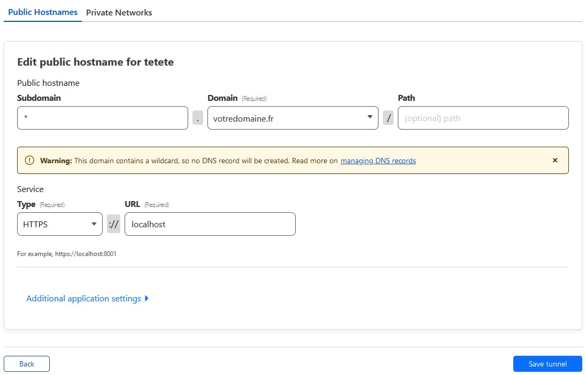

Dans la présentation générale de ma stack d'auto-hébergement [L'auto-hébergement en 2023](https://www.cosmecharlier.fr/posts/auto-hebergement/), je parle brièvement de Cloudflare Tunnels. Après divers essais, je suis arrivé à une solution qui me convient bien et que je partage avec vous aujourd'hui.


Selon la définition que l'on donne à l'auto-hébergement, le fait d'utiliser un service tel que Cloudflare peut pour certains s'avérer une hérésie. Il est vrai que cela constitue une entorse à l'autonomie par rapport aux géants du web, dont Cloudflare fait clairement partie (Cloudflare est utilisé par environ 17% des sites dans le monde).
Je présente ici des concepts et une manière de faire, libre à chacun ensuite de choisir si c'est ce qu'il recherche dans la pratique de l'auto-hébergement ou pas.


Voici le menu du jour :


## Présentation de Cloudflare

Cloudflare est en 2023 un acteur majeur du web, qui fournit de multiples services. Le service principal que nous allons regarder aujourd'hui est celui de *reverse proxy* (ou serveur mandataire inverse en français).
En bref, dans ce cas d'utilisation, Cloudflare se positionne entre votre serveur et les clients qui viennent le visiter. 


flowchart LR
    subgraph Avec Cloudflare
    direction LR
    C((Visiteur)) -->|https| D{Cloudflare} -->|https| E(Votre serveur)
    end
    subgraph Sans Cloudflare
    direction LR
    A((Visiteur)) -->|https| B(Votre serveur)
    end


Ce positionnement permet d'apporter différents services :
- Un service de CDN[^1] qui va mettre en cache une partie du contenu de votre site pour pouvoir le proposer au téléchargement plus rapidement, sans avoir à le télécharger depuis votre serveur à chaque appel (pour le contenu comme les images, ou des documents statiques)
- Un service de WAF[^2] qui va filtrer le trafic entrant sur votre site, et bloquer le trafic identifié comme malveillant
- Un service anti-DDoS[^3] qui va dévier et encaisser le trafic en cas d'attaque de type DDoS vers votre site 
- La fourniture automatique de certificats SSL qui permettront de chiffrer votre trafic en *HTTPS* (même si vous devriez le faire sans avoir besoin de Cloudflare)
- Et la partie qui nous intéresse aujourd'hui, qui est le masquage de l'adresse IP de votre serveur. En positionnant Cloudflare comme *reverse proxy*, vous faites pointer l'enregistrement DNS de votre site non pas vers votre adresse IP personnelle, mais vers celle des serveurs de Cloudflare

Ce fonctionnement en coupure du trafic entrant est aujourd'hui très répandu dans le milieu professionnel, et ce service est fourni par différents acteurs du marché. Nous nous concentrons aujourd'hui sur Cloudflare car il propose une offre gratuite, accessible aux particuliers et donc facile à mettre en place pour de l'auto-hébergement.

[^1]: *Content Delivery Network* ou *réseau de diffusion de contenu*
[^2]: *Web Application Firewall* ou *pare-feu pour applications web*
[^3]: *Distributed Denial of Service* ou *attaque de déni de service distribuée*, correspond à une attaque sur un site qui vise a le saturer en lui envoyant un grand nombre de requêtes

## Déploiement de Cloudflare sur votre domaine


Cette procédure ne s'applique qu'à ceux qui ont déjà un nom de domaine, comme par exemple pour ce site 'cosmecharlier.fr'. Si vous n'en avez pas,vous pouvez en acheter un à Cloudflare, mais pour éviter de mettre tous vos œufs dans le même panier, il est préférable d'aller chez des fournisseurs français tels que [Gandi](https://www.gandi.net) ou [OVH](https://www.ovhcloud.com/fr/).
Si vous êtes déjà client de Cloudflare, vous pouvez passer au [paragraphe suivant](#bases-dutilisation-de-cloudflare).


Pour bénéficier des services de Cloudflare, commencez par vous inscrire sur leur [site](https://dash.cloudflare.com/sign-up)

Créez ensuite votre compte et choisissez d'activer l'option standard :


Ensuite, saisissez votre nom de domaine et, à l'étape suivante, choisissez l'offre gratuite :


Cloudflare va ensuite récupérer les enregistrements DNS qu'il trouve. Il est possible qu'il ne les trouve pas tous, donc si vous en avez qui ne sont pas dans la liste mettez-les de côté pour les recréer plus tard.

A l'étape 3, Cloudflare vous donnera les serveurs de noms à utiliser pour votre domaine, en remplacement de ceux qui étaient utilisés auparavant. La procédure varie en fonction de votre registrar de nom de domaine.

Après les délais de propagation qui peuvent prendre quelques heures, Cloudflare deviendra votre nouveau gestionnaire de domaine.
Pour vérifier que la modification a bien été effectuée, vous pouvez exécuter la commande suivante :
```
whois votredomaine.fr | grep 'Name Server'
```
Vous devriez voir les serveurs de nom de Cloudflare apparaître.

## Bases d'utilisation de Cloudflare

Comme nous l'avons vu précédemment, le premier usage de Cloudflare est comme d'un *reverse proxy*.

Pour comprendre les principales notions à manipuler,  nous allons nous intéresser ici à deux types d'enregistrements DNS :
- Les enregistrements de type A (Adresse) : ils font correspondre un nom de domaine ou un sous-domaine à une adresse IP
- Les enregistrements de type CNAME (*Canonical Name*, ou *nom canonique*) : ils permettent de générer des alias d'un domaine vers un autre


### Enregistrement de type A 
Dans un cas classique, sans Cloudflare, vous avez au moins un enregistrement de type A qui pointe vers votre adresse IP pour qu'un client qui souhaite consulter votre site sache a quelle adresse IP il doit envoyer ses requêtes.

Pour Cloudflare, c'est pareil. Vous devez créer dans l'interface un enregistrement de type A, qui va faire pointer par exemple votre sous-domaine `www` vers l'IP de votre serveur. La subtilité avec Cloudflare, c'est que l'objectif, comme on l'a dit plus haut, est de ne pas afficher votre IP directement à vos visiteurs, mais de positionner Cloudflare entre vos visiteurs et vous. Donc, dans ce cas, quand vous activez dans l'enregistrement DNS l'option 'Proxy' (avec le nuage orange), Cloudflare va mettre sa propre IP dans l'enregistrement DNS public de votre sous-domaine, et redirigera ensuite en interne les requêtes vers votre serveur. Si vous avez un enregistrement avec le proxy activé, vous pouvez vérifier que ce n'est pas votre adresse IP qui aparaît dans l'enregistrement DNS de type A quand vous exécutez la commande :
```
dig +noall +answer votredomaine.fr
```
On voit donc ici que Cloudflare masque votre IP et que si quelqu'un arrive sur votre site, en cherchant l'IP de l'enregistrement DNS, il ne tombera pas sur votre IP personnelle mais sur une IP de Cloudflare.


Une fois votre premier enregistrement de type A configuré, il peut arriver que vous souhaitiez déclarer d'autres sous-domaines sur votre domaine, pour séparer différents services que vous souhaitez auto-héberger. C'est là qu'entrent en jeu les enregistrements de type CNAME.

### Enregistrement de type CNAME
Prenons un exemple, où vous hébergez un site web sur `www.votredomaine.fr`. Sur Cloudflare, vous configurez un enregistrement de type A vers l'IP de votre serveur (disons 1.2.3.4).
| Type    | Nom       | Contenu                | Proxy ? |
|---------|-----------|------------------------|---------|
| A       | www       | 1.2.3.4                | Oui     |

Maintenant, vous voulez rajouter un autre sous-domaine pour héberger, par exemple, une instance de [Gitea](https://gitea.io/) pour versionner votre code source. A cette fin, vous pouvez créer dans Cloudflare une entrée de type CNAME, qui va s'appuyer sur votre enregistrement de type A qui contient déjà votre IP.
| Type    | Nom       | Contenu                | Proxy ? |
|---------|-----------|------------------------|---------|
| A       | www       | 1.2.3.4                | Oui     |
| CNAME   | git       | www.votredomaine.fr    | Oui     |

Avec cette configuration, vous pouvez maintenant accéder à votre instance Gitea à l'adresse `git.votredomaine.fr`.

Le principal intérêt du CNAME est qu'avec cette approche, si vous changez d'adresse IP, il n'y aura qu'un seul enregistrement à modifier : celui de type A. Ainsi, si votre FAI change votre adresse IP, ou que vous déplacez votre serveur vers une autre adresse IP (ou que vous suivez ce guide jusqu'au bout !), la migration sera plus rapide. Si, comme moi, vous vous retrouvez à utiliser des dizaines de sous-domaines, la maintenance de vos enregistrements DNS s'en trouvera grandement simplifiée.


## Le problème restant avec le *reverse proxy*

Si l'on reprend le schéma du début du billet, nous avons maintenant un site auquel les visiteurs accèdent sans connaître notre adresse IP. Nous avons donc fait une bonne partie du travail ! Néanmoins, une faille subsiste.


Car même si les visiteurs qui accèdent à votre site à travers son URL classique passent bien par Cloudflare, votre adresse IP publique doit forcément se retrouver exposée sur Internet, et certains ports (au moins le port 443) doivent être ouverts sur votre serveur. Même si un acteur malveillant ne tombe pas sur votre adresse IP à partir de votre domaine public, votre IP peut être découverte par d'autres biais, voire par hasard par des robots qui scannent les adresse IP une par une en testant des combinaisons au hasard. 


flowchart LR
subgraph f [ ]
direction LR
    subgraph Avec Cloudflare
    direction LR
    C((Visiteur)) -->|https| D{Cloudflare} -->|https| E(Votre serveur)
    end
    A[/Acteur malveillant/] -->|port 443| E
end


Le probléme est que dans ce schéma, Cloudflare doit communiquer avec votre serveur via des appels HTTPS, et donc votre serveur doit être accessible depuis l'internet public.


C'est maintenant qu'arrive (enfin !) le sujet dont je parlais au début du billet : les tunnels

## Cloudflare Tunnels

Cloudflare propose une fonctionnalité appelée *Tunnels*, qui permet d'établir un tunnel VPN[^4] entre l'infrastructure Cloudflare et votre serveur. L'intérêt de cette approche est que votre serveur n'a plus besoin d'être accessible sur Internet, car c'est lui qui va initier la création du VPN vers les serveurs de Cloudflare. Cela vous permet d'avoir une sécurité optimale en rendant votre site accessible sans avoir à ouvrir de port vers l'internet public.

[^4]: *Virtual Private Network* ou *réseau privé virtuel*, technologie qui permet à plusieurs appareils de communiquer entre eux comme s'ils étaient sur un réseau local, même à travers l'internet public. Les communications entre les appareils sont chiffrées et restreinte aux membres identifiés du réseau privé. 


flowchart LR
subgraph f [ ]
direction LR
    subgraph Avec Cloudflare Tunnels
    direction LR
    C((Visiteur)) -->|https| D{Cloudflare} o--o|Tunnel| E(Votre serveur)
    end
    A[/Acteur malveillant/] -.-x|port 443 fermé| E
end



Cette fonctionnalité fait partie de l'offre nommée *Zero Trust*. Elle reste gratuite pour des besoins d'auto-hébergement, même si elle demande de rentrer un moyen de paiement valide (carte bancaire ou Paypal). Vous pouvez y accéder depuis l'interface de Cloudflare depuis le menu *Trafic > Cloudflare Tunnel* ou via ce lien : [https://one.dash.cloudflare.com/](https://one.dash.cloudflare.com/).

Pour votre première connexion, vous choisissez un nom (sans importance pour la suite), et choisissez le plan gratuit. L'inscription demande la saisie d'une carte bancaire qui ne sera pas débitée (ou d'un compte Paypal). Vous pouvez utiliser une carte virtuelle si votre banque vous le propose pour limiter les risques. Personnellement, j'utilise cette fonctionnalité depuis plusieurs années et je n'ai jamais été débité de quoi que ce soit.

Vous remarquerez que ce portail, contrairement à l'interface principale de Cloudflare, n'est pas accessible en français. Je vais vous guider dans les étapes de création d'un tunnel, surtout qu'une fois en place il n'est plus nécessaire de venir faire de configuration dessus.

### Création d'un tunnel


Une fois connecté sur le portail *Zero Trust*, vous accédez à la page de *Tunnels* par le menu de gauche, dans la section *Access*.


Vous pouvez créer votre tunnel en cliquant sur *Create a tunnel*. Vous donnez un nom à votre tunnel et vous arrivez ensuite sur la page de téléchargement de l'agent *cloudflared*, qui est le programme à installer sur votre serveur pour créer le tunnel VPN entre votre serveur et Cloudflare.


Vous choisissez votre système d'exploitation, votre architecture CPU, et vous exécutez sur votre serveur les commandes données dans le cadre gris de gauche. Ces commandes vont successivement :
- Télécharger la bonne version de l'agent *cloudflared*
- Installer l'agent
- Configurer l'agent avec le jeton de sécurité qui permettra d'authentifier votre serveur comme étant bien rattaché à votre compte



A noter que Cloudflare propose une installation via Docker. Sur un serveur d'auto-hébergement, où vous allez sans doute expérimenter différentes choses, je suis plus à l'aise de faire tourner l'agent directement par le système : cela me laisse tout le loisir de jouer, d'arrêter ou de casser Docker (après tout c'est en cassant qu'on apprend) sans risquer de perdre l'accès à mon site. Après, libre à chacun de choisir l'approche qu'il veut !



Une fois l'agent installé sur votre serveur, vous pouvez cliquer sur *Next* et arriver sur la configuration du routage réseau de votre domaine.



Ici, vous pouvez configurer le routage entre votre domaine et votre serveur. Afin d'autoriser tous les sous-domaines à accéder à votre serveur, je vous conseille de mettre une étoile dans le champ *Subdomain*, et de choisir votre domaine dans le menu déroulant. Ensuite, il faut configurer les champs *Service* qui indiquent comment le serveur web auquel vous voulez donner accès sur votre serveur est accessible. Le cas classique est de choisir le type *HTTPS* et l'URL *localhost* si votre serveur web écoute sur la même machine que celle sur laquelle tourne l'agent *cloudflared* sur le port 443. Si votre configuration est différente, vous pouvez choisir par exemple le protocole *HTTP* et l'URL *localhost:8080* si votre serveur écoute sur le port 8080 sans SSL. Vous pouvez ensuite sauvegarder votre configuration en cliquant sur *Save tunnel*.


Une fois votre tunnel sauvegardé, vous revenez sur la page principale de gestion des tunnels. Votre tunnel doit apparaître, avec son nom, et surtout son ID dans la colonne *Tunnel ID*. Si l'agent tourne correctement et que le tunnel est actif, son statut est au vert et mentionne *HEALTHY*. Si ce n'est pas le cas, il faut vérifier que l'installation s'est bien passée et que l'agent est configuré et actif.


Vous pouvez mainenant copier l'ID du tunnel et le garder sous la main, il servira à l'étape suivante.

### Routage du réseau vers le tunnel

Maintenant que votre tunnel est opérationnel, il reste à router le trafic de vos utilisateurs vers ce tunnel. Et cela se passe dans la page de configuration du DNS.


L'étape restante est simple : il faut rediriger les sous-domaines que vous voulez envoyer vers votre serveur vers l'adresse du tunnel, via un enregistrement CNAME. La destination du CNAME est : `{tunnel-ID}.cfargotunnel.com`. Ainsi vous modifiez l'enregistrement de type A que vous aviez configuré pour votre sous-domaine principal (par exemple www), vous le mettez de type CNAME et vous le faites pointer vers l'URL `{tunnel-ID}.cfargotunnel.com` en remplaçant `{tunnel-ID}` par l'ID du tunnel que vous avez créé à l'étape précédente.


| Type    | Nom       | Contenu                      | Proxy ? |
|---------|-----------|------------------------------|---------|
| CNAME   | www       | {tunnel-ID}.cfargotunnel.com | Oui     |
| CNAME   | git       | www.votredomaine.fr          | Oui     |


Et voilà ! Votre routage devrait fonctionner correctement. Si vous aviez d'autres sous-domaines configurés en CNAME vers votre sous domaine principal, il sont migrés automatiquement également vers le tunnel. Vous pouvez maintenant fermer l'exposition des ports 80 et/ou 443 de votre serveur à l'extérieur (soit dans votre pare-feu, soit en coupant une redirection de ports que vous auriez faite dans votre box Internet), votre site restera accessible !


## Conclusion

Avec cette approche, vous pouvez maintenant exposer vos sites et services sur Internet sans avoir besoin d'ouvrir de port sur votre serveur/box internet/firewall externe. C'est une situation optimale en termes de sécurité car cela vous permet de ne pas être vulnérable à une attaque directe sur votre adresse IP personnelle, étant donné qu'elle n'est pas accessible de l'extérieur. Attention car bien sûr, cela ne vous rend pas invulnérable : si les services que vous hébergez présentent des failles, celles-ci restent exploitables par un acteur malveillant. Toutefois avec la protection du WAF[^2] Cloudflare, vous disposez d'une couche supplémentaire de sécurité. 

J'espère que ce billet vous aura été utile, où au moins instructif ! Je compte continuer à partager mes expériences, trucs et astuces que j'ai accumulés sur l'auto-hébergement depuis plus de 10 ans. Pour être alerté des prochaines publications sur le blog, vous pouvez suivre le [flux RSS](https://www.cosmecharlier.fr/index.xml).

<div style="text-align: right"> 

*Poursuivons la discussion sur le fil du [Journal du Hacker](https://www.journalduhacker.net/)* 
</div>
